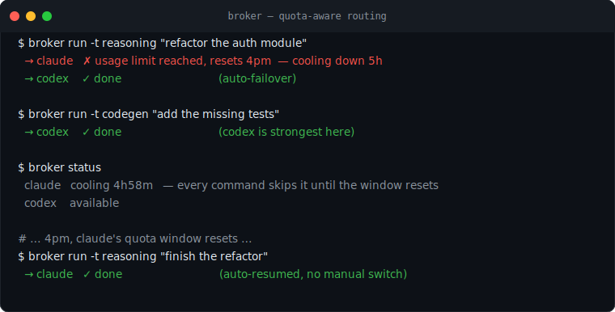

# modelbroker

> **Run out of Claude quota? Keep working on Codex. Quota back? Switch back.**
> A quota-aware multi-model router: route each task to the model that's strongest at it, fail over
> when one runs out of quota, and resume the moment its window resets.

[](https://github.com/yingchen-coding/modelbroker/actions/workflows/ci.yml)
[](pyproject.toml)
[](LICENSE)



Stop babysitting model quotas.

You pay for two or three coding assistants (Claude Code, Codex, ...), each with its own usage limit.
When one hits its limit you either stop, or manually switch. modelbroker does the switch for you,
routes each kind of task to whichever model is best at it, and flips back when the quota window
resets. Zero dependencies, no API keys; it drives the CLIs you already have.

## Star This If

- You use multiple AI coding CLIs and lose time when one hits quota.
- You want task-based routing instead of one default model for every job.
- You need local traces showing which provider handled each task, why failover happened, and when it recovered.

## What it does

- **Strength-based routing.** A `codegen` task goes to Codex; an `architecture` or `reasoning` task
  goes to Claude — you define the policy.
- **Quota-aware fail-over.** A provider that returns a rate-limit / usage-limit error is **cooled
  down** for its reset window and the task automatically retries on the next provider. No wasted
  call, no manual switch.
- **It remembers.** The cooldown is persisted, so the *next* command still knows Claude is limited
  until 4pm and keeps routing to Codex — then flips back when the window resets.
- **Cost visibility.** Add optional `cost_per_run_usd` estimates per provider and `broker trace`
  rolls up spend by provider. It does not invent token counts your CLIs did not expose.
- **Cost-aware routing.** Keep your hand-tuned routing order, force cheapest-first routing, or use a
  balanced policy that keeps task fit first and then picks the cheaper comparable provider.
- **Safe by construction.** The prompt is passed as a single argument (or stdin), never interpolated
  into a shell — no injection from prompt text.

## Quickstart

```bash
pip install -e .          # or: pip install git+https://github.com/yingchen-coding/modelbroker
broker init              # write a starter broker.toml (claude + codex)

broker route -t codegen  # → would use: codex
broker route -t reasoning# → would use: claude
broker status            # availability / cooldown / usage per provider
broker doctor            # check each provider's CLI is installed / on PATH (no prompt run)

broker run -t codegen "write a quicksort in python"
# claude out of quota → uses codex; claude back in window → uses claude. automatically.

broker run --quiet -t codegen "write a quicksort in python"
# suppresses broker routing chatter; prints only provider output unless the run fails.

broker skills
broker run -t writing --skill stop-slop "rewrite this README section"
# adds a low-fluff quality contract before routing to the best available provider.

broker run -t codegen --skill context-window "fix the failing test"
# tells the model to pass only the smallest useful context, code-only when possible, and compact
# before long-context drift.

broker trace             # see your real routing / failover / cost behavior over time
# runs: 42 · failovers: 7 · quota events: 9 · unresolved: 0
#   claude  handled 31
#   codex   handled 11

broker cost              # see spend risk and cheaper routing recommendations
# estimated_cost: $1.2400
# recommendations:
#   set [budget].cost_strategy = "balanced" ...

broker runtime           # see token throughput / cost-hour / error-rate from traces
# tokens_per_second: 122.50
# cost_per_1k_tokens: $0.0180

broker quota             # see quota-hit pressure and fallback recommendations from traces
# claude       attempts=10 handled=6 quota_hits=3 quota_rate=30.0%

broker dashboard         # write a self-contained HTML dashboard (spend, overpay, quota) → open it
broker dashboard --usage ~/.claude/projects   # add a token-usage panel from your transcripts

broker evidence add glm-example --source-url https://example.com --article "launch note"
broker evidence verify glm-example --command "python eval.py" --passed
broker evidence check glm-example
```

## How a config looks

`broker.toml` — providers (with strengths + how they signal "out of quota") and a routing policy:

```toml
[providers.claude]
command = "claude -p {prompt}"     # {prompt} = the task, passed as one argument
strengths = ["reasoning", "architecture", "refactor", "review"]
reset = "5h"                       # cool down this long after a usage-limit error
quota_markers = ["usage limit", "rate limit", "429", "resets at"]
cost_per_run_usd = 0.0              # optional estimate for broker trace summaries
# Optional and deliberately provider-specific: retry this request elsewhere without marking
# Claude unhealthy or cooling it down.
refusal_markers = ["classified as a policy risk", "cannot assist with this request"]

[providers.codex]
command = "codex exec {prompt}"
strengths = ["codegen", "boilerplate", "tests"]
reset = "1h"
cost_per_run_usd = 0.0

[routing]
default = ["claude", "codex"]      # global fail-over order
[routing.tasks]
codegen   = ["codex", "claude"]    # route by task to the model that's strongest at it
reasoning = ["claude", "codex"]
```

Any CLI works — add a `[providers.<name>]` with its command and quota markers (gemini, aider, a
local model via `ollama run`, …).

Cost optimization is policy-driven: set `cost_per_run_usd`, inspect `broker trace`, then route cheap
tasks to cheaper providers in `[routing.tasks]` while reserving expensive models for the work they
actually win.

For a hard ceiling, add this under `[budget]`:

```toml
[budget]
state_file = ".broker-state.json"
max_cost_per_run_usd = 0.02
cost_strategy = "balanced"            # ordered | cheapest | balanced
```

Providers whose `cost_per_run_usd` exceeds the ceiling are skipped before execution. Set the value
to `0.0` to disable cost filtering. `cost_strategy` controls the remaining candidates:

- `ordered`: preserve your configured routing order.
- `cheapest`: route to the lowest estimated `cost_per_run_usd` first.
- `balanced`: prefer providers whose `strengths` include the task, then choose the cheaper one.

`refusal_markers` handles over-refusal separately from outages and quota. When a configured phrase
matches, the same prompt is tried on the next provider, the attempt is traced as `refusal`, and the
first provider remains available for unrelated requests. Keep the markers narrow: broad phrases
such as `cannot` can also occur in valid answers.

## Cost Radar

`broker cost` turns trace history and provider price estimates into an operational cost report:

- total estimated spend and average cost per run
- provider-level spend split
- **overpay by task** — for each task type, what you actually spent vs the cheapest provider that
  could have done it
- providers over the configured per-run ceiling
- routing recommendations when a cheaper comparable provider exists
- warnings when failovers or unresolved runs show the policy is too brittle

### Cost tiers: stop paying a premium model for mechanical work

The single biggest real cost leak isn't a bad price — it's running **low-difficulty work** (search,
scan, count, boilerplate) on a **premium model**. List those task types under `[budget]`:

```toml
[budget]
mechanical_tasks = ["search", "scan", "count", "summarize", "boilerplate"]
```

Two things happen:

1. **Routing guard** — a mechanical task always routes to the *cheapest capable* provider, even if
   your order or `cost_strategy` would have sent it to the premium one.
2. **Waste report** — `broker cost` splits overpay into **mechanical waste** (a cheap task billed to
   a premium model — pure waste, always fix) and a **quality tradeoff** (a hard task where a cheaper
   option exists — only route down if quality holds). It will not give the naive advice "route your
   reasoning to the cheapest model"; premium is worth it where difficulty is real.

```text
⚠ mechanical_waste: $54.6700 — low-difficulty work billed to a premium model. Route it cheaper, always.
possible_savings (quality tradeoff): $5.6800 — harder tasks where a cheaper provider exists.
overpay_by_task:
  search  400 run(s)  spent $30.0000  vs $1.6000 on haiku  → overpaid $28.4000  ⚠ MECHANICAL WASTE
  reasoning 80 run(s)  spent $6.0000  vs $0.3200 on haiku  → overpaid $5.6800  (quality tradeoff)
```

This is deliberately estimate-based. modelbroker does not invent token counts your CLIs did not
emit; it uses the `cost_per_run_usd` numbers you configure so routing decisions stay auditable.

## Usage audit: what am I actually spending, and how much is waste?

`broker usage` reads your real agent-CLI transcripts (Claude-Code-style JSONL with per-message
`usage` token counts), costs them at list prices by model tier, and estimates how much of the spend
is **mechanical work** (search / scan / read orchestration) that ran on a premium model when a cheap
one would do.

```bash
broker usage ~/.claude/projects
# sessions: 123 · assistant turns: 18,631
# estimated cost (list prices): $12,156.77
#   opus    $ 11,801.45   (5,663.3M tokens)
#   sonnet  $    355.32   (699.5M tokens)
#
# mechanical work on a premium model: 5,894 turns · $3,151.54 now vs $244.17 on haiku
# → recoverable: $2,907.37 (24% of total)
# BEFORE $12,156.77   AFTER $9,249.40
```

It classifies a turn as mechanical when it's dominated by search/scan/read tool calls with little
generated text — the exact work `mechanical_tasks` routing sends to a cheap tier. Real transcripts,
real token counts, list prices you can read in `broker/usage.py`; nothing is invented.

**Daily budget alert.** Add `--today` to count only today's turns and `--threshold` to exit nonzero
when you're over — so any alerting mechanism (a cron + desktop notification, CI, a webhook) can hook
it. No platform-specific notification is baked in; the exit code is the signal.

```bash
broker usage ~/.claude/projects --today --threshold 20
# … BEFORE $393.44 …
# ⚠ OVER: estimated $393.44 exceeds threshold $20.00        # (exits 2)
```

## Dashboard

`broker dashboard` renders everything above into one **self-contained HTML file** — inline CSS and
inline SVG bars, no JS libraries, no server, no external requests, so it opens offline. It reuses the
same analyses as the CLI, so the dashboard and the terminal never disagree.

```bash
broker dashboard                              # → broker-dashboard.html
broker dashboard -o ~/broker.html --usage ~/.claude/projects   # add a token-usage panel
```

Panels: runs / spend / failovers / mechanical-waste cards, spend-by-provider bars, overpay-by-task
(waste vs quality-tradeoff), quota pressure per provider, and — with `--usage` — cost by model tier
with the before/after.

## Runtime Radar

`broker runtime` is for token-factory style operational questions:

- tokens per second
- cost per 1k tokens
- estimated cost per runtime hour
- error rate
- provider-level throughput and cost split

It reads optional `tokens`, `total_tokens`, or `input_tokens` + `output_tokens` fields from the
local trace. If your provider CLI does not expose token counts, the report warns instead of treating
usage volume as throughput evidence.

## Quota Radar

`broker quota` is for the boring operational question that matters during real coding work: which
provider is actually reliable right now?

It reads the local trace and reports:

- quota-hit rate per provider
- failover pressure from quota, missing CLIs, transient errors, and policy refusals
- unresolved runs where every provider failed
- whether a provider should stay primary, move behind a fallback, or be demoted until stable

This is intentionally trace-based. A headline about quota problems is not enough; modelbroker looks
at your own local runs before changing routing policy.

## Model Evidence Gate

`broker evidence` keeps hyped new models out of automatic routing until they pass your local checks.
The registry is local by default in `.broker-evidence.json` and is ignored by git.

```bash
broker evidence add new-model \
  --source-url https://example.com/model-card \
  --article "vendor launch note" \
  --requirement ollama

broker evidence verify new-model --command "python eval.py --model new-model" --passed
broker evidence incident new-model --severity high --title "unsafe jailbreak regression" \
  --mitigation "disable auto routing until patched"
broker evidence check new-model
```

A model is blocked when it has not passed local verification, required local runtimes are missing,
or it has a high/critical incident. Low and medium incidents stay visible without automatically
blocking routing.

Provider news can feed this gate, but it should never directly rewrite active routing. Convert
frontier-lab strategy, model-release, benchmark, quota, and pricing news into evidence records, then
verify them locally before changing task-specific routes. See
[`docs/provider-intelligence.md`](docs/provider-intelligence.md).

## Prompt Skills

`--skill stop-slop` is for prompts where the real problem is output quality, not model choice. It
wraps your request with a strict response contract: answer directly, use concrete evidence, remove
generic filler, state uncertainty precisely, and keep the final response tight.

`--skill context-window` is for long tasks. It tells the model to pass the smallest sufficient
context for the current step, use code-only context when code is enough, delay bulky logs/data until
the step that needs them, and compact or summarize before the context window gets unstable. If the
environment supports a slash command such as `/compact`, the skill explicitly tells the model to use
it at checkpoints.

`--skill llm-cost-saving` cuts LLM spend by routing each unit of work to the cheapest tier: Opus
for genuine judgment, Sonnet subagent for search/grep/summarize, Haiku for mechanical bulk work,
plain scripts for zero-model tasks (counting rows, checking job status, diffing files). For data
analysis it enforces code-first (generate a script, user runs it, paste the result) over loading
large datasets into context. For background jobs it blocks sleep-poll loops in favor of
`run_in_background=True`.

```bash
broker run -t review --skill stop-slop "review this PR"
broker run -t writing --skill stop-slop "make this launch copy sharper"
broker run -t codegen --skill context-window "continue this implementation"
broker run -t architecture --skill context-window --skill stop-slop "design the next slice"
broker run -t reasoning --skill llm-cost-saving "analyze this 500K-row dataset"
```

Skills are applied before routing, so they work with the same quota fail-over and trace behavior as
normal runs. Use `broker skills` to list available skills.

## How fail-over works

```
broker run -t reasoning "refactor this module"
  → claude (preferred for reasoning)
      └─ "Error: usage limit reached, resets at 4pm"   → cool down claude 5h
  → codex (next in order)
      └─ ok                                            → return codex's output
# every later command skips claude until its window resets, then routes back to it
```

## License

MIT © Ying Chen
